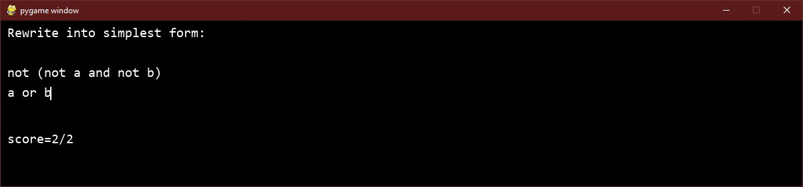

# Logic training game
You are given expressions and are asked to provide a equivalent expression that is as simple as possible.

# How to run

`python typing.py`

# Setup

Uses `python 3.8` and `pygame`.

Example steps for setup:

    # Setup python local environment and install required modules
    python -m venv .env
    source .env/Scripts/activate
    pip install -r requirements.txt

    # Get the submodules needed.
    git submodule init
    git submodule update

    # Start the game.
    python typing.py
